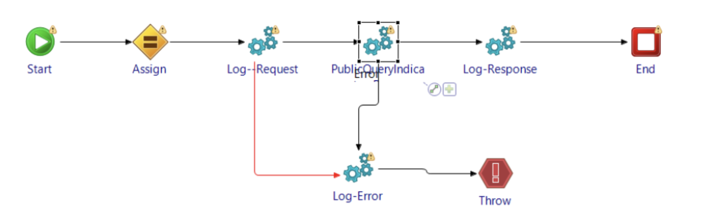

# Capstone
[GitHub Repo](https://github.com/d-sedano/capstone-project-group-3)
### Functional Overiew
- This application performs backend functions of an ecommerce website, connecting the SQL database to the microservice components of the website frontend.
### Implementation
- Recieves a JSON object in the format of the object to be updated in the database, then carries out the update. 

  - user/update/userId - Updates registraion details for user of ID userId

  - role/get/id - Returns the role assigned to user of ID id

### Impact if service is down
- Frontend applications will not be able to carry out CRUD operations for products or users in the database. 
### Type
- Component

