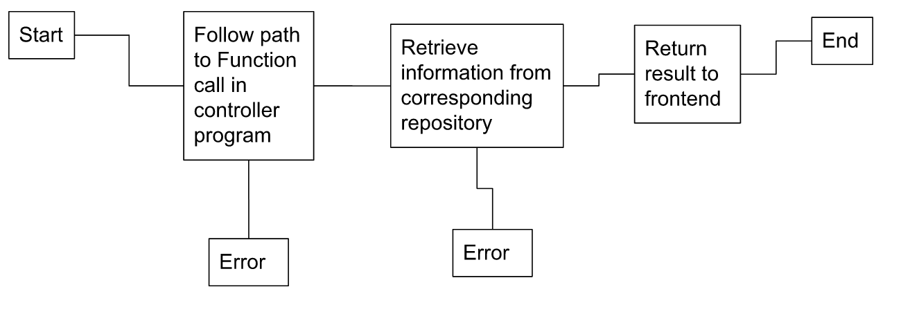

# Capstone
[GitHub Repo](https://github.com/d-sedano/capstone-project-group-3)
### Functional Overview
- This application performs backend functions of an ecommerce website, connecting the SQL database to the microservice components of the website frontend.
### Implementation
- Recieves a JSON object in the format of the object to be updated in the database, then carries out the update. 

  - user/update/{userId} - Updates registraion details for user of ID userId
  - user/registration - Creates a new user in the database
  - user/login - Makes call to Okta for authentication
  - users/getIdToken/{token} - Returns User ID associated with the given Okta token
  - user/get/{userEmail} - Returns user associated with the given email address
  - user/get/{userId} - Returns user associated with given userId
  - user/all - Returns a list of all registered users
  - user/delete/{userId} - Deletes user associated with the given userId

  - role/get/{id} - Returns the role assigned to user of ID id

  - product/update/{id} - Updates details for product of given id
  - product/add - Adds inputted product to the database
  - product/get/{id} - Returns product associated with given id
  - product/get/byName - Returns product with specified name
  - product/all - Returns list of all registered products
  - product/delete/{id} - Deletes product associated with given id
 
 

### Impact if service is down
- Frontend applications will not be able to carry out CRUD operations for products or users in the database. 
### Type
- Component

